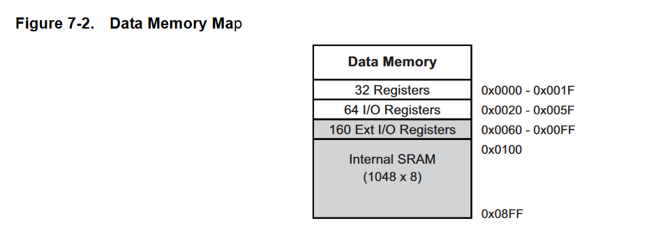
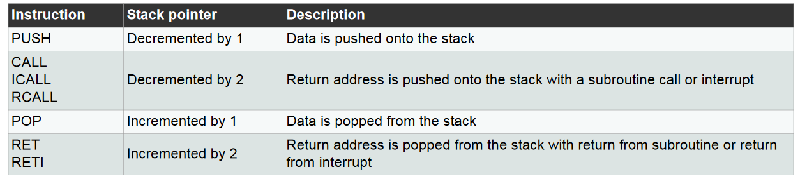

# Exercises:

## Part 1
From Tanenbaum ch. 5 (see eventually the pdf in the materials folder): Ex. 4, 6, 14, 21 and 23. (Ex. 23 is a puzzle, that can be fun but also tricky, so don't spend too much time on it).

- 4 Description: Given the memory values below and a one-address machine with an accumulator, what values do the following instructions load into the accumulator?

word 20 contains 40 

word 30 contains 50

word 40 contains 60

word 50 contains 70

a. LOAD IMMEDIATE 20

b. LOAD DIRECT 20

c. LOAD INDIRECT 20

d. LOAD IMMEDIATE 30

e. LOAD DIRECT 30

f. LOAD INDIRECT 30

**Answer:** 
a. LOAD IMMEDIATE 20 = 20 value,
b. LOAD DIRECT 20 = 40    value,
c. LOAD INDIRECT 20 = 60  value,
d. LOAD IMMEDIATE 30 = 30 value,
e. LOAD DIRECT 30 = 50    value,
f. LOAD INDIRECT 30 = 70  value,

- 6
To fcking long

**Answer:**

- 14

**Answer:**

- 21

**Answer:**

MOV 0 to the address that needs to be cleared?
LOAD 0 into the address??

- 23

**Answer:**

## Part 2
Look into the ATmega328P Datasheet (pdf in materials folder) and find answers to the following questions:

a) How many data registres does the ATmega328P contain?

**Answer:**

*(Found on page 18)

b) Which instructions influence the stack pointer?

**Answer:**

*(Found on page 13)*

c) How wide is the data bus (number of bits)?

**Answer:**
16 or 32 bits wide?
*(Found on page 17 tak stack)*

d) Which addressing modes can be used in SRAM data memory?

**Answer:**

The five different addressing modes for the data memory cover: Direct, indirect with displacement, indirect, indirect with
pre-decrement, and indirect with post-increment. 
In the register file, registers R26 to R31 feature the indirect addressing pointer registers.
*(Found on page 18)*

## Part 3

Have a look in the AVR Instruction Set Manual (pdf in materials folder) and find answers to the following questions:

a) How many registers can be accessed simultaneously with register direct addressing?

**Answer:**

2 see page 15

b) How many different types of conditional branches is supported in the instruction set?

**Answer:**
page 21???
