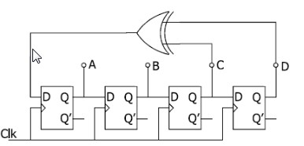

# Digital Hardware Design lecture 4 exercise 1

The figure below shows a 4-stage shift register made out of D-flip-flops. 

The Q output from the last 2 stages are used as inputs for an XOR gate. 

The output of the XOR gate is fed to the 1st flip-flop as an input.

As initial value the 1st stage holds an 1  (A=1). The subsequent stages 

hold zeros.

a) Determine the content of register stages after each of the the sub-sequent clock pulses and put results in a table.

| round | A | B | C | D | XOR_out |
|-------|---|---|---|---|---------|
| 0     | 1 | 0 | 0 | 0 | 0       |
| 1     | 0 | 1 | 0 | 0 | 0       |
| 2     | 0 | 0 | 1 | 0 | 1       |
| 3     | 1 | 0 | 0 | 1 | 1       |
| 4     | 1 | 1 | 0 | 0 | 0       |
| 5     | 0 | 1 | 1 | 0 | 1       |
| 6     | 1 | 0 | 1 | 1 | 0       |
| 7     | 0 | 1 | 0 | 1 | 1       |
| 8     | 1 | 0 | 1 | 0 | 1       |

b) What happens if all stages are initial zero.

| round | A | B | C | D | XOR_out |
|-------|---|---|---|---|---------|
| 0     | 0 | 0 | 0 | 0 | 0       |
| 1     | 0 | 0 | 0 | 0 | 0       |
| 2     | 0 | 0 | 0 | 0 | 0       |
| 3     | 0 | 0 | 0 | 0 | 0       |
| 4     | 0 | 0 | 0 | 0 | 0       |
| 5     | 0 | 0 | 0 | 0 | 0       |
| 6     | 0 | 0 | 0 | 0 | 0       |
| 7     | 0 | 0 | 0 | 0 | 0       |
| 8     | 0 | 0 | 0 | 0 | 0       |
