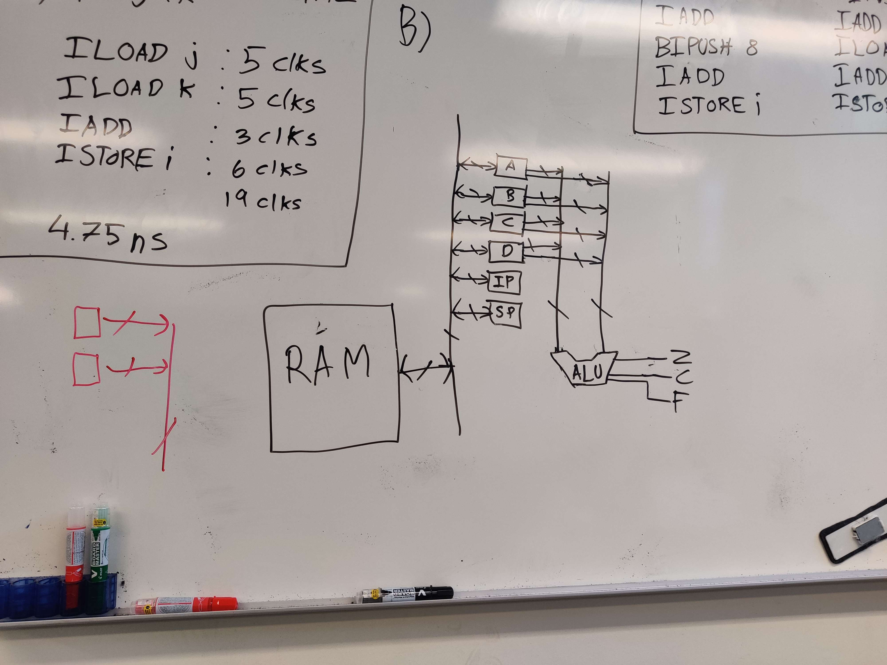

# Digital Hardware Design - lecture 9 exercises

## Exercise A

### 4.1
What are the four steps a CPU uses to execute instructions

Register based machine:
1. Instruction fetch
2. Instruction decode
3. Execute
4. Store

Stack based machine:
1. Instruction fetch
2. Instruction decode
3. Operand fetch
4. Execute
5. Store

### 4.2
In Fig. 4-6, the B bus register is encoded in a 4-bit field, but the C bus is represented as a bit map. Why?

The B bus is a data word and the C bus consists of (somewhat independent) control signals.

### 4.4
Give two different IJVM translations for the following Java statement:
```java
i = j + m + 8
```

Solution 1:
```IJVM
ILOAD j
ILOAD m
IADD
BIPUSH 8
IADD
ISTORE i
```

Solution 2:
```IJVM
BIPUSH 8
ILOAD j
IADD
ILOAD m
IADD
ISTORE i
```

### 4.5
Give the Java statement that produced the following IJVM code:
```IJVM
ILOAD m
ILOAD n
ISUB
BIPUSH 3
ISUB
DUP
IADD
ISTORE i
```

```java
i = (m-n-3) + (m-n-3)
```
Or before optimization:
```java
i = 2*(m-n-3)
```

### How long does a 4-GHz Mic-1 take to execute the following Java statement?
```java
i = j + k
```

The IJVM code is:
```IJVM
ILOAD j  // 5 cycles
ILOAD k  // 5 cycles
IADD     // 3 cycles
ISTORE i // 6 cycles
```

So 19 cycles in total and $\frac{19}{4\mathrm{GHz}} = 4.75 \,\mathrm{ns}$ execution time.

## Exercise B


